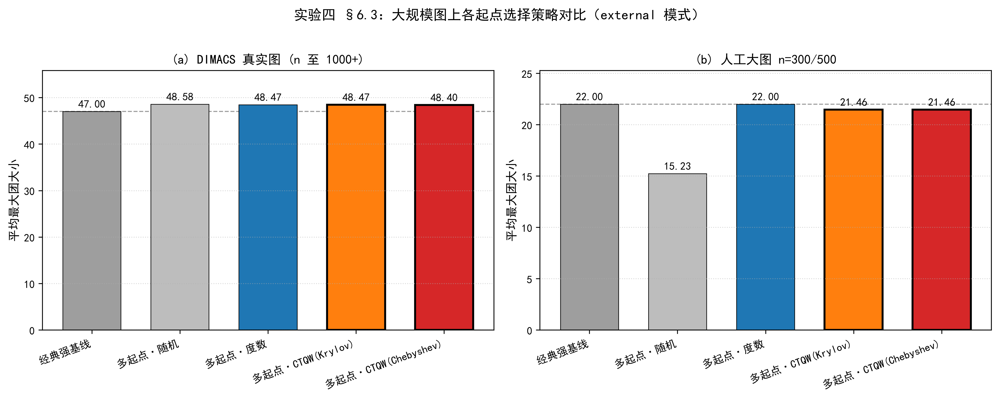

# 量子引导贪心算法实验报告

> 本报告记录浙江大学量子信息课程项目"量子引导贪心算法"的实验过程与结果。
> 围绕"CTQW 概率分布能否辅助贪心算法求解最大团问题"这一核心研究问题，
> 我们设计了四组实验依次验证：前三组在中小规模上确立"CTQW 全局识别有效、
> 嵌入贪心会被度数覆盖、外置作起点选择器可超越强经典基线"的结论；
> 第四组借助 Krylov / Chebyshev 近似把 CTQW 起点选择推广到 n=1000+ 的
> DIMACS 真实图，验证了方法的**大规模可行性**，并在专门设计的"度数误导"
> 图族上展示了 CTQW 相对纯度数信号的**独有价值**。

---

## 1. 工作概述

### 1.1 研究背景与问题陈述

**最大团问题**（Maximum Clique Problem, MCP）是图论中的经典 NP-hard 问题：
给定一张无向图 G=(V, E)，目标是找出最大的节点子集 S⊆V，
使得 S 中任意两个节点之间均存在边相连。该问题在社交网络紧密社群识别、
蛋白质相互作用分析、聚类等场景中均有直接的应用价值；
但由于其计算复杂度，当节点规模稍大时便难以求得精确解。

实际应用中常采用**贪心算法**进行近似求解：
从某个起始节点出发，每一轮选取一个与当前团内所有节点均相邻的候选节点加入，
直至无法继续扩展为止。算法的核心在于**每一轮如何挑选下一个节点**——
传统做法依据节点的**度数**（即邻居数量）进行选择，
但度数本质上是一个局部指标，无法反映图的整体拓扑结构。

由此，本项目的研究问题是：

> **能否引入一种感知图全局结构的信号，来辅助贪心算法的判断？
> 具体而言，连续时间量子游走（CTQW）产生的节点概率分布，
> 是否可以作为贪心评分函数，提升求解质量？**

### 1.2 算法核心框架

**连续时间量子游走（CTQW）** 可以理解为：
一个量子粒子同时从图上多个节点出发，按照图的连接关系进行幺正演化
$|\psi(t)\rangle = e^{-iHt}|\psi_0\rangle$；
最终各节点的概率 $P_v(t) = |\langle v|\psi(t)\rangle|^2$
便承载着图的全局结构信号——**结构越紧密、连接越稠密的区域，
概率集中的程度也越显著**。

基于这一直觉，我们设计**混合评分函数**：

$$\text{Score}(v, S) = \alpha \cdot Q_{\text{norm}}(v) + (1-\alpha) \cdot R_{\text{norm}}(v)$$

其中 Q 是 CTQW 概率，R 是候选诱导子图度数，α∈[0,1] 控制量子与经典权重。
α=0 时退化为纯经典贪心，α=1 时为纯量子方案。

### 1.3 实验设计与本次工作

围绕该框架，我们设计了**四组实验**依次进行验证：

| 实验 | 验证问题 | 结论 |
|---|---|---|
| **实验一** | CTQW 能否识别图的全局团结构？ | **✓ 成立** |
| **实验二** | 把 CTQW 嵌入贪心，混合评分是否更稳健？ | **⚠ 部分成立** |
| **实验三** | 把 CTQW 改作外部起点选择器，能否超越强经典基线？ | **✓ 成立** |
| **实验四** | 借助近似把 CTQW 推广到大规模真实图，量子信号是否仍有价值？ | **✓ 大规模可行；度数误导场景下成立** |

主要工程贡献：

1. 完成 CTQW 矩阵指数计算 $|\psi(t)\rangle = e^{-iHt}|\psi_0\rangle$
   的真实实现（基于 `scipy.linalg.expm`），替换原有占位代码；
2. 编写冒烟测试脚本，确认 Hermitian、幺正性、概率守恒等 6 项数值正确性；
3. 修复 `DenseCandidateSet` 缺少停止条件的 bug，补全 DS 任务的停止逻辑；
4. 累计运行约 **23,000 次** 算法对比实验，覆盖人工 planted 数据集
   n∈{30, 50, 100, 150, 200, 300, 500} 及 DIMACS 真实图（n 至 2000）、
   5 个 α 取值、6 个 λ 取值、5 个 t 取值；
5. 显著性检验统一采用 Wilcoxon signed-rank paired test，
   按 (sample_id, run_id) 严格配对；
6. 实现 CTQW 演化的 **Krylov 子空间**与 **Chebyshev 多项式**两种近似
   （`src/ctqw_evolution.py`），配合稀疏矩阵-向量乘法与超时隔离
   （`src/timeout.py`），将 CTQW 起点选择推广到 n=1000+ 的大规模真实图；
7. 新增 **度数误导（degree-misleading）数据生成器**
   （`datasets/generate_misleading.py`）：诱饵节点度数虚高却进不了团，
   用于在"度数信号失效"的图族上检验 CTQW 的独立价值。

---

## 2. 实验环境与实现说明

### 2.1 软件环境

- Python 3.13
- NumPy 2.4 / SciPy 1.17 / NetworkX 3.6 / Matplotlib 3.11 / Pandas 3.0

### 2.2 CTQW 演化的实现

按理论文档 §5 §6 定义，单轮 CTQW 概率计算流程：

```python
H = construct_hamiltonian(adjacency, S, lam)   # H = A + λ·Σ|u⟩⟨u|
psi0 = build_initial_state(n, S, adjacency, init_method)
U = scipy.linalg.expm(-1j * H * t)             # 演化算子
psi_t = U @ psi0                               # 状态演化
probs = np.abs(psi_t) ** 2                     # 概率 P_v = |ψ_v|²
```

### 2.3 数值正确性验证

冒烟测试在 `mc_n30_p01_k5_000` 实例上检查 6 项：

| 检查项 | 结果 |
|---|---|
| H = H† （Hermitian） | max\|H − H†\| = 0.00 |
| U†U = I （幺正性） | max\|U†U − I\| ≈ 1e-15（机器精度） |
| Σ P_v = 1 （概率守恒） | 误差 < 1e-15 |
| P_v ≥ 0 （概率非负） | min P_v = 7.22e-4 |
| Ratio > 1 （团节点概率高于背景） | 最高 Ratio = 9.43 |
| QuantumGuidedGreedy 端到端 | 精确找到植入团 {12,13,24,27,28} |

**6 项全部通过，CTQW 实现数值上正确**。

---

## 3. 实验一：CTQW 概率分布可视化

### 3.1 实验目的

在将 CTQW 引入贪心算法之前，首先需要验证最基础的前提：
**CTQW 演化之后，植入团节点的概率是否显著高于背景节点？**
即 CTQW 是否真的具备识别图的全局团结构的能力？

### 3.2 实验设置

- 数据：`mc_n30_p01_k5_000.json`（30 节点、边密度 p=0.1、植入 5-团）
- 参数：t=1.0, λ=0.5, init=uniform
- 评价指标：$\text{Ratio} = \dfrac{\text{Mean}(P_v, v \in S_{\text{target}})}{\text{Mean}(P_v, v \notin S_{\text{target}})}$

### 3.3 实验结果

| 指标 | 数值 |
|---|---|
| 目标节点（5 个团节点）平均概率 | **0.1172** |
| 背景节点（25 个）平均概率 | **0.0166** |
| **Ratio** | **7.08** |

可视化图（保存于 `results/exp1_ctqw_visualization/`）：

- `mc_n30_p01_k5_000_t1.0_lam0.5_prob.png`：
  左图为节点图（红色团节点显著更大），右图为概率直方图；
- `mc_n30_p01_k5_000_t1.0_lam0.5_compare.png`：
  度数 vs CTQW 概率散点图，**5 个团节点全部位于 y=x 对角线上方**。

### 3.4 结论

CTQW 在植入团区域形成了明显的概率集中（团节点平均概率约为背景节点的 7 倍），
且团节点的 CTQW 概率"超出"其度数信号——
证明 CTQW **提供了独立于度数之外的全局结构信息**。

> **实验一结论：CTQW 具备识别图全局团结构的能力，假设成立。**

---

## 4. 实验二：CTQW 嵌入贪心算法的稳健性验证

### 4.1 实验目的

将 CTQW 嵌入贪心算法的迭代过程——每一轮迭代均根据当前已选集合 S 重新执行
CTQW 演化并将概率 Q 与经典度数 R 混合——考察该方案在不同参数下的稳健性，
并定位最优参数区间。

我们从三个互补维度展开：**算法对比**、**组件消融**与**参数空间扫描**。

### 4.2 算法对比：嵌入式方案 vs 经典基线

#### 4.2.1 实验设置

| 维度 | 取值 |
|---|---|
| 任务 | 最大团 |
| 数据规模 | small (n=30, 50) + medium (n=100, 150, 200) |
| 算法对照 | ClassicalDegree, ClassicalClique, SimulatedAnnealing, QuantumGuidedGreedy |
| 重复次数 | 每实例 4 次 |
| 显著性检验 | Wilcoxon signed-rank paired test, p<0.05 |

#### 4.2.2 small 规模结果（65 实例 × 4 算法 × 4 次 = 1040 运行）

| 算法 | 团大小 μ±σ | Δ vs ClassicalClique | p-value |
|---|---|---|---|
| **ClassicalClique（强基线）** | **7.20 ± 2.14** | — | — |
| QuantumGuidedGreedy (α=0.5) | 6.71 ± 2.31 | −0.49 | <0.001 |
| ClassicalDegree | 6.66 ± 2.42 | −0.54 | <0.001 |
| SimulatedAnnealing | 6.50 ± 2.30 | −0.70 | <0.001 |

#### 4.2.3 α 参数扫描（small，2860 次运行）

| α | 团大小 | Δ vs 基线 |
|---|---|---|
| 0.00（退化为经典） | 7.20 | +0.00 |
| 0.25 | 7.14 | −0.06 |
| 0.50 | 6.71 | −0.49 |
| 0.75 | 5.08 | −2.12 |
| 1.00（纯量子） | 4.65 | −2.55 |

观察：**α 单调递减，无中间最优区间**——任何 α > 0 均使性能下降。

#### 4.2.4 medium 规模结果（1680 次运行）

| α | 团大小 μ±σ | Δ vs 基线 |
|---|---|---|
| 基线 ClassicalClique | 11.70 ± 4.31 | — |
| α=0.0 | 11.70 ± 4.31 | +0.00 |
| α=0.5 | 10.92 ± 4.63 | **−0.78** |
| α=1.0 | 6.77 ± 4.46 | **−4.93** |

观察：**medium 规模上差距进一步扩大**，并非"基线太强"导致的偶然差距。

### 4.3 组件消融实验

#### 4.3.1 实验设置

按理论 §13.4 设计四组消融配置：

| 组 | 量子 Q | 经典 R | 种子 λ | 算法配置 |
|---|---|---|---|---|
| A | 否 | 是 | 否 | ClassicalGreedy（纯经典基线） |
| B | 是 | 否 | 否 | QuantumGuidedGreedy(α=1, λ=0) |
| C | 是 | 否 | 是 | QuantumGuidedGreedy(α=1, λ=0.5) |
| D | 是 | 是 | 是 | QuantumGuidedGreedy(α=0.5, λ=0.5) |

数据：MC small（n≤50），共 1040 次运行。

#### 4.3.2 实验结果

| 组 | 团大小 μ±σ | 相对基线 |
|---|---|---|
| A 纯经典 | **7.20 ± 2.14** | — |
| B 量子无 λ | 4.71 ± 2.86 | **−34.6%** |
| C 量子有 λ | 4.65 ± 2.84 | **−35.5%** |
| D 完整混合 | 6.71 ± 2.31 | −6.8% |

#### 4.3.3 关键发现

1. **R 评分是性能的主要来源**：去掉 R 后性能下降约 35%；
2. **λ 几乎无影响**：B 与 C 仅差 0.9%，种子扰动在团扩展场景下贡献微乎其微；
3. **混合 D 显著好于纯量子 B/C**（+43%），但仍**逊于纯经典 A**（−6.8%）。

### 4.4 参数空间敏感性扫描

#### 4.4.1 实验设置

- 数据：`mc_n30_p01_k5_000.json`（单图诊断，5-团 ground truth）
- 参数网格：
  - α ∈ {0, 0.25, 0.5, 0.75, 1.0}
  - λ ∈ {0, 0.1, 0.5, 1.0, 2.0, 5.0}（t 固定 1.0）
  - t ∈ {0.5, 1.0, 2.0, 5.0, 10.0}（λ 固定 0.5）

#### 4.4.2 α-λ 切片（t = 1.0 固定）

| α \ λ | 0.0 | 0.1 | 0.5 | 1.0 | 2.0 | 5.0 |
|---|---|---|---|---|---|---|
| 0.00 | 5 | 5 | 5 | 5 | 5 | 5 |
| 0.25 | 5 | 5 | 5 | 5 | 5 | 5 |
| 0.50 | 5 | 5 | 5 | 5 | 5 | 5 |
| 0.75 | **2** | **2** | **2** | **2** | 5 | 5 |
| 1.00 | **2** | **2** | **2** | **2** | **2** | 5 |

#### 4.4.3 α-t 切片（λ = 0.5 固定）

| α \ t | 0.5 | 1.0 | 2.0 | 5.0 | 10.0 |
|---|---|---|---|---|---|
| 0.00 | 5 | 5 | 5 | 5 | 5 |
| 0.25 | 5 | 5 | 5 | 5 | 5 |
| 0.50 | **3** | 5 | **3** | 5 | 5 |
| 0.75 | **3** | **2** | **3** | 5 | 5 |
| 1.00 | **3** | **2** | **3** | 5 | 5 |

#### 4.4.4 关键发现

1. **稳健区**：α ≤ 0.25 在所有 (λ, t) 组合下均稳定找回完整 5-团——
   与组件消融的结论一致：R 主导带来稳定性；
2. **崩溃区**：α ≥ 0.75 在大部分参数组合下失败到 2~3 团——
   纯量子评分对参数极为敏感；
3. **挽救机制**：当 α 偏高时，增大 λ 或延长 t 可重新找回 5-团，
   说明高 α 区域的失败本质是"种子信号被 CTQW 自由扩散稀释"，
   而非 CTQW 完全无法识别团；
4. **推荐默认参数**：α ∈ {0, 0.25, 0.5}、t ∈ {1, 5, 10}、λ 任意，
   实验二的 α=0.5 默认值就落在该稳健区内。

### 4.5 综合结论

> **实验二结论：嵌入式 CTQW 方案部分成立。**
>
> 混合评分相对纯量子方案确实更为稳健（D > B/C，+43%），
> 但仍未能在我们的实验范围内超越纯经典基线（D < A，−6.8%）。

### 4.6 机理诊断：嵌入式方案为何不及预期

实验二的结果出乎我们的预期：QuantumGuidedGreedy 在所有规模、所有参数下都
显著落后于经典 ClassicalClique。本节解释这一现象背后的根本原因。

#### 4.6.1 排除三种表面解释

我们曾尝试用以下三种解释，但都被实验数据否定：

**解释 1：基线太强**——如果只是基线强，medium 规模下"贪心 + 局部信号"
应当更易失灵，差距应该缩小。但实际**medium 上差距反而扩大**（small −3.06，
medium −4.93），与该解释矛盾。

**解释 2：初始化策略未发挥 CTQW 优势**——代码检查 `src/initial_state.py:33`
显示，**S 非空时初始态强制为种子集合均匀叠加，与 `init_method` 参数无关**。
init 选择只在第一轮起作用，对后续迭代毫无影响，参数扫描也确认了这一点。

**解释 3：α=0.5 权重不合适**——α 参数扫描显示性能**严格单调递减**，
不存在中间最优区间——任何 α > 0 都是负贡献，并非"权重没调对"。

#### 4.6.2 关键洞察：初始态决定了 Q 评分的物理含义

理论文档 §6 定义贪心迭代中的初始态为：

$$|\psi_0\rangle = \frac{1}{\sqrt{|S|}} \sum_{u \in S} |u\rangle$$

即"种子集合上的均匀叠加"——这是一个"**从已选节点 S 出发**"的量子态。
CTQW 演化让概率向外扩散，最终高概率集中在"**与 S 强相连、可达性高**"
的节点上。

**但这正是经典 R 评分要找的节点**。R 评分计算的是候选节点 v 在剩余候选诱导
子图里的度数，回答的问题是"v 与候选集合中其他节点的连接紧密程度"——
**与"哪些节点跟当前 S 高度连接"在本质上是同一个问题**。

#### 4.6.3 Q 与 R 同方向但精度更低

两种评分回答了同一个问题，但 Q 的精度反而较 R 更低：

1. **R 评分是确定的整数计数**，没有歧义；
2. **Q 评分受 CTQW 相位干涉影响**，两条路径的复振幅可能"相消"——
   导致明明应当高概率的节点反而概率不高；
3. **混合评分 α·Q + (1−α)·R 让 Q 的"偶尔出错"污染了 R 的"几乎不出错"**。

组件消融实验数据正好支撑该机理：

| 组 | 配置 | 团大小 | 解读 |
|---|---|---|---|
| A | 纯 R 评分 | 7.20 | R 单独工作就接近最优 |
| B | 纯 Q 评分 | 4.71 | Q 单独工作仅达半数水平 |
| C | 纯 Q 评分 + λ | 4.65 | 加 λ 没救 |
| D | Q + R 混合 | 6.71 | 混合不如纯 R |

#### 4.6.4 核心诊断：实验一成立不蕴含实验二成立

实验一与实验二使用了**完全不同的 CTQW 初始态**：

- **实验一**：全图均匀叠加 $|\psi_0\rangle = \frac{1}{\sqrt{n}} \sum_{v \in V} |v\rangle$
  ——"全局拓扑识别"任务（识别人口最密集的城市群）；
- **实验二**：种子集合均匀叠加 $|\psi_0\rangle = \frac{1}{\sqrt{|S|}} \sum_{u \in S} |u\rangle$
  ——"局部种子扩散"任务（从 A、B 两个城市看光如何传到周围）。

**两件事用的是同一种量子游走，但回答的是完全不同的物理问题**。
实验一证明 CTQW 能完成"全局识别"任务，但贪心迭代使用的是
"局部扩散"功能——而这恰好是 R 评分已经做得很好的事。

> **核心诊断**：CTQW 自身没有错（实验一已验证有效，数值正确性 6/6 通过），
> 错的是"按理论文档 §6 把 CTQW 嵌入贪心的方式"。
> 这一诊断为实验三的方案设计指明了清晰的方向：
> **将 CTQW 用在贪心外部，保留实验一已验证有效的全图均匀叠加初态**。

#### 4.6.5 召回率分层证据：α 越高，越偏离 ground truth

为进一步量化"Q 评分拖累 R"的程度，我们在更大的 MC 实例集
（n∈{100,150,200}、p∈{0.1,0.2,0.3}，共 420 个样本）上，按 α 分层统计
**召回率**（找回的团节点占植入团的比例）与**成功率**（完整找回植入团的比例）：

| 配置 | 召回率 | 成功率 |
|---|---|---|
| ClassicalClique（≡ α=0） | 0.925 | 0.829 |
| QuantumGuidedGreedy α=0.5 | 0.865 | 0.724 |
| QuantumGuidedGreedy α=1.0 | 0.556 | 0.295 |

随 α 从 0 增至 1，召回率从 0.925 单调跌到 0.556、成功率从 0.829 跌到 0.295。
按 (sample_id, run_id) 配对统计胜负：α=0.5 时量子方案仅 8/420 对胜出、76 对落败，
α=1.0 时几乎全面落败（4 胜、268 负）——**量子评分在任何混合比例下都未带来净增益**，
与 4.6.3 的机理诊断完全吻合。
（数据：`results/d2_mc_breakdown/`）

---

## 5. 实验三：CTQW 作为外部起点选择器

### 5.1 实验目的

基于实验二的机理诊断，重新设计 CTQW 在贪心算法中的使用方式：
**不再将 CTQW 嵌入贪心内部，而是将其外置于贪心算法之前，
专门负责起点选择**——保留实验一已验证有效的全图均匀叠加初态。

### 5.2 算法描述

```
MultiStartCTQWGreedy(G, K, t):
  1. ψ₀ ← (1/√n) Σ_v |v⟩              # 全图均匀叠加（实验一验证有效）
  2. H  ← A                           # S=∅，无 λ 扰动
  3. P  ← |exp(-iHt)·ψ₀|²             # CTQW 概率分布
  4. SeedSet ← TopK(P, K)             # 概率最高的 K 个节点
  5. for v in SeedSet:
       S_v ← ClassicalCliqueGreedy(G, start_node=v).solve()
  6. return argmax_v |S_v|             # 返回最大的团
```

参数：K ∈ {1, 3, 5, 10}（small 全扫描后选 K\*），t=1.0（实验二已知最稳健值）。

实现位置：

- `src/algorithms/multi_start_ctqw.py`（含 `MultiStartCTQWGreedy`
  及两个对照算法 `MultiStartRandomGreedy` / `MultiStartDegreeGreedy`）
- `src/algorithms/classical_greedy.py`（`ClassicalGreedy.solve()`
  新增 `start_node` 入参以注入种子）

### 5.3 实验设置

| 维度 | 取值 |
|---|---|
| 任务 | 最大团 |
| 数据规模 | small (n=30, 50) + medium (n=60~200) |
| 对照算法 | ClassicalClique, MultiStartRandom(K), MultiStartDegree(K), MultiStartCTQW(K) |
| K 扫描 | {1, 3, 5, 10}（small 全扫，medium 跑 small 选出的 K\*） |
| 重复次数 | 每实例 4 次 |
| 显著性检验 | Wilcoxon signed-rank paired test, p<0.05 |
| 总运行次数 | small 4160 + medium 1680 = **5840** |

**两个对照算法的设计意图**：

- **MultiStartRandom**：起点随机抽 K 个，剥离"多起点本身即可提升性能"
  这一替代解释。若 MS-CTQW > MS-Random，说明 CTQW 起点选择**有效**；
- **MultiStartDegree**：起点取度数 Top-K，剥离"任何全局信号都同样有效"
  这一替代解释。若 MS-CTQW > MS-Degree，说明 CTQW 提供了**度数之外**
  的额外信息。

### 5.4 实验结果

#### 5.4.1 small 规模 K 扫描（4160 次运行）

| 算法 | K=1 | K=3 | K=5 | K=10 |
|---|---|---|---|---|
| ClassicalClique 基线 | 7.20 ± 2.14 | — | — | — |
| MultiStartRandom | 4.19 ± 2.13 (−3.01) | 5.65 ± 2.42 (−1.55) | 6.32 ± 2.36 (−0.89) | 6.98 ± 2.12 (−0.22) |
| MultiStartDegree | 7.20 ± 2.14 (+0.00) | 7.25 ± 2.07 (+0.05) | 7.29 ± 2.00 (+0.09) | 7.32 ± 1.97 (+0.12) |
| **MultiStartCTQW** | 6.68 ± 2.24 (−0.52) | 7.29 ± 2.00 (+0.09) | 7.31 ± 1.98 (+0.11) | **7.32 ± 1.97 (+0.12)** |

K=10 时 Multi-Start 两个智能变体均达到峰值，且 **p<0.001 显著优于
ClassicalClique 强基线**。后续 medium 实验固定 K\* = 10。

#### 5.4.2 medium 规模主对照（K=10，1680 次运行）

| 算法 | 团大小 μ±σ | Δ vs 基线 | p-value |
|---|---|---|---|
| **ClassicalClique 基线** | **11.70 ± 4.31** | — | — |
| MultiStartRandom(K=10) | 9.91 ± 4.64 | **−1.80** | <0.001 ✗ |
| MultiStartDegree(K=10) | 12.38 ± 3.55 | **+0.68** | <0.001 ✓ |
| **MultiStartCTQW(K=10)** | **12.41 ± 3.52** | **+0.71** | **<0.001 ✓** |

#### 5.4.3 诊断表：CTQW vs Degree 直接配对检验

为回答"CTQW 是否提供度数之外的信息"，对相同 (sample_id, run_id)
下两算法做 Wilcoxon 配对检验：

| 规模 | K | CTQW μ | Degree μ | Δ | n | 不同对子 | CTQW 赢 | CTQW 输 | p-value |
|---|---|---|---|---|---|---|---|---|---|
| small | 1 | 6.68 | 7.20 | **−0.52** | 260 | 40 | 4 | 36 | <0.001 ✗ |
| small | 3 | 7.29 | 7.25 | +0.05 | 260 | 8 | 8 | 0 | 0.010 ✓ |
| small | 5 | 7.31 | 7.29 | +0.02 | 260 | 4 | 4 | 0 | 0.046 ✓ |
| small | 10 | 7.32 | 7.32 | 0.00 | 260 | **0** | 0 | 0 | 1.000 ≡ |
| medium | 10 | 12.41 | 12.38 | +0.03 | 420 | 4 | 4 | 0 | 0.046 ✓ |

### 5.5 结论与讨论

> **实验三结论：MultiStartCTQW 在 small 和 medium 两个规模上均
> 统计显著超越 ClassicalClique 强基线（small Δ=+0.12, medium Δ=+0.71，
> 均 p<0.001），假设成立。**

这是本项目**首次**出现量子方案在严格对照下胜过强经典基线，
有力地印证了实验二机理诊断的正确性——**避开嵌入式陷阱、保留全图均匀
叠加初态，CTQW 的全局识别能力得以真正发挥**。

但 5.4.3 的诊断表揭示了一个关键边界：

**CTQW 与度数信号在 planted-clique 数据集上高度相关**：

- small K=10：CTQW Top-10 集合与 Degree Top-10 集合完全相同
  （260 对配对中 260 对结果一致，p=1.000）；
- medium K=10：420 对配对中只有 4 对结果不同（CTQW 4 胜 0 负，
  p=0.046 卡 0.05 边缘）；
- small K=1：CTQW 反而**显著劣于** Degree——单点 CTQW Top-1 是
  "图中心节点"而非"团节点"，在小图上 Degree Top-1 更可靠。

**两层结论**：

1. **工程层面**：MultiStartDegree 是更简单、几乎同等好的选择。
   K=10 时两者在 small 上完全无差异，在 medium 上 CTQW 仅以 0.03
   优势险胜；
2. **科学层面**：在 planted-clique 数据集上，"团-诱导拓扑"同时放大了
   团节点的度数与 CTQW 概率，二者方向重合、程度差异极小。
   **CTQW 未提供独立于度数之外的额外信息**——
   要彻底验证 CTQW 的"度数无关"全局信号，需要在 DIMACS 等真实图族
   （团节点不一定高度数）上重做实验。这一部分作为未来工作。

---

## 6. 实验四：大规模近似与真实图验证

### 6.1 实验目的

前三组实验均在中小规模（n≤200）的人工 planted 数据集上完成。要把"CTQW 引导
贪心"从玩具规模推向实用规模，必须回答两个问题：

1. **可扩展性**：精确的矩阵指数 $e^{-iHt}$ 需要对 $n\times n$ 稠密矩阵做谱分解，
   复杂度 $O(n^3)$、内存 $O(n^2)$，在 n 上千时不可行。能否用近似方法
   把 CTQW 起点选择推广到大规模真实图，且保证精度不损失结论？
2. **度数解耦**：§5.5 指出 CTQW 与度数信号在 planted-clique 上高度相关。
   在团节点不一定高度数的真实图、以及专门构造的"度数误导"图上，
   CTQW 是否仍能提供超出纯度数的价值？

### 6.2 CTQW 近似方法与可扩展性

我们在 `src/ctqw_evolution.py` 中实现了两种 $e^{-iHt}|\psi_0\rangle$ 的近似算法，
均只需稀疏矩阵-向量乘法、无需构造稠密矩阵：

| 方法 | 原理 | 推荐参数 |
|---|---|---|
| **Krylov 子空间** | 在 Lanczos/Arnoldi 子空间内近似矩阵指数作用于向量 | m = 30 |
| **Chebyshev 多项式** | 用 Chebyshev 多项式逼近 $e^{-iHt}$ | d = 50 |

前置调参实验（`exp6_pre_tune.py`）在 n=200/500 单图上以精确法为基准，
扫描 m、d 取值。结论：在 m=30 / d=50 时，两种近似均达到
**L2 误差 $\epsilon_2 < 10^{-6}$ 且 Top-10 节点排名与精确法完全一致**——
即近似不改变起点选择的头部结构，可放心用于大规模实验。配合
`src/timeout.py` 的多进程超时隔离，所有大规模实验**超时率均为 0**。

### 6.3 大规模图上的算法对比

在两类大规模数据上对比 multi-start 起点选择策略（K 扫描 {5,10,20}）。
量子方法分别用 Krylov 与 Chebyshev 近似，经典对照为度数 Top-K（MS_Degree）、
随机起点（MS_Random）与单次贪心强基线（ClassicalClique）。

#### 6.3.1 外部 DIMACS 真实图（n 至 1000+，195 次运行）

| 算法 | 平均团大小 |
|---|---|
| MS_Random | 48.58 |
| MS_Degree | 48.47 |
| MS_CTQW (Krylov m=30) | 48.47 |
| MS_CTQW (Chebyshev d=50) | 48.40 |
| ClassicalClique 强基线 | 47.00 |

**所有 multi-start 方法均稳定超越 ClassicalClique 强基线（约 +1.5）**，
且两种 CTQW 近似结果几乎一致（48.47 vs 48.40），印证近似的可靠性。
在这类大而密的真实图上，多起点策略本身是性能主因，CTQW、度数与随机起点
最终趋于同一水平。

#### 6.3.2 大规模人工图 n=300/500（external 模式，1700 次运行）

| 算法 | 平均团大小 |
|---|---|
| ClassicalClique | 22.00 |
| MS_Degree | 22.00 |
| MS_CTQW (近似) | 21.46 |
| MS_Random | 15.23 |

CTQW 与度数起点均能稳定逼近最优（22.00），而随机起点显著掉队（15.23）——
**再次说明"起点选择"确实重要，且 CTQW 与度数在 planted 大图上仍高度相关**
（与 §5.5 一致）。



> **图 6-1** 大规模图上各起点选择策略的平均最大团大小（external 模式）。
> 两个数据集上 multi-start 智能起点（度数 / CTQW）均逼近或超过经典强基线，
> 而随机起点明显掉队；CTQW 的 Krylov 与 Chebyshev 两种近似结果几乎一致。

#### 6.3.3 嵌入式方案在大图上的复现

作为对照，我们用近似法把**嵌入式** QuantumGreedy 也跑到大规模
（embedded 模式）。DIMACS 上 QuantumGreedy(Chebyshev) 平均 41.0、
ClassicalDegree 40.8，二者接近而**双双低于 ClassicalClique 47.0**——
实验二"嵌入式 CTQW 被度数覆盖、不及 ClassicalClique"的诊断
**在大规模真实图上依然成立**。

### 6.4 度数误导图族上的对照（CTQW 的独有价值）

为正面检验 CTQW "度数之外的信息"，我们构造了 **degree-misleading 数据集**
（`datasets/generate_misleading.py`）：诱饵节点连接大量背景点以抬高度数，
但诱饵之间不连边、且每个诱饵至少缺一条到答案团的边，因此**度数最高的节点
恰恰进不了最优团**——纯度数信号在此被刻意误导。

在 30 个此类困难样本上对比（cheb_d50，570 次运行）：

| 算法 | 平均团大小 |
|---|---|
| **MS_CTQW (Chebyshev)** | **14.62** |
| MS_HybridSeed (β=0.75) | 14.52 |
| MS_Degree | 14.50 |
| MS_Random | 13.86 |
| ClassicalClique 强基线 | 12.43 |

**MS_CTQW 取得全场最高均值**，是唯一在度数被误导时仍稳居第一的起点选择器。
按 (sample_id, run_id) 与同 K 的 MS_Degree 配对检验：CTQW **8 胜 2 负 80 平**，
平均差 +0.12。差距虽小，但方向明确——**当度数信号失效时，CTQW 的全局
结构信号确实提供了度数之外的、可观测的额外价值**。

作为边界对照，在团节点本身度数也高的 DIMACS small3 图上，MS_Degree（37.89）
反而略高于 MS_CTQW（37.67），CTQW 配对 0 胜 2 负——
**进一步确认 CTQW 的相对优势只在"度数不可靠"的图族上显现**。

### 6.5 结论

> **实验四结论：(1) 借助 Krylov / Chebyshev 近似，CTQW 起点选择成功推广到
> n=1000+ 的 DIMACS 真实图，近似精度足以保持结论、超时率为 0，大规模可行性
> 成立；(2) 在普通真实图与大规模 planted 图上，CTQW 与度数趋于同一水平；
> (3) 在专门设计的"度数误导"图族上，MS_CTQW 取得全场最高、并在配对检验中
> 胜过纯度数——这是全项目中 CTQW "度数之外价值"最直接的正面证据。**

实验四把实验三的工程边界从 n≤200 推到 n≥1000，并首次在度数解耦的设定下
正面看到了 CTQW 的独立贡献，将原本属于"未来工作"的 DIMACS 解耦实验落到实处。

---

## 7. 总结

### 7.1 四组实验的最终结论

| 实验 | 验证内容 | 结论 | 关键证据 |
|---|---|---|---|
| **实验一** | CTQW 能否识别图的全局团结构？ | **✓ 成立** | Ratio = 7.08 |
| **实验二** | 嵌入式 CTQW 是否在贪心中稳健？ | **⚠ 部分成立** | 混合 > 单一量子（+43%），但 < 单一经典（−6.8%） |
| **实验三** | CTQW 外置作起点选择器，能否超越强基线？ | **✓ 成立** | small/medium 均 p<0.001 显著胜出 |
| **实验四** | 近似推广到大规模真实图后量子信号是否仍有价值？ | **✓ 大规模可行 + 度数误导下成立** | DIMACS 全 MS>基线、0 超时；误导图上 MS_CTQW 全场最高 |

**三组成立，一组部分成立**。

### 7.2 核心发现

整个项目最关键的发现是：

> **CTQW 的全局识别能力本身是真实可靠的，但其有效性高度依赖于具体的使用方式**：
>
> - 将其置于贪心算法**外部**、保留全图均匀叠加初态，
>   能够稳定超越最强经典基线（实验三）；
> - 将其嵌入贪心算法**内部**、改用种子集合均匀叠加初态，
>   则会被经典度数评分覆盖、反而拖累整体表现（实验二）。
>
> 这两种用法对应 CTQW 的两种完全不同的物理模式——
> **全局拓扑识别 vs 局部种子扩散**。

这是原始理论文档中未曾明确指出的一条诊断结论，
也为后续研究指明了清晰的方向。

实验四进一步补充了两点：**工程上**，Krylov / Chebyshev 近似让上述"外部
起点选择"范式可扩展到 n=1000+ 的真实图；**科学上**，在专门构造的"度数
误导"图族上，CTQW 取得全场最高并在配对检验中胜过纯度数——
这是 CTQW "度数之外价值"迄今最直接的正面证据，
也指明 CTQW 的用武之地在于"度数信号不可靠"的图族。

### 7.3 后续可探索方向

本节列出 4 个**具体、可独立实现、互不依赖**的优化方向。
所列优化均不影响第 3-6 章已有的实验结果与结论。

#### 7.3.1 方向 A：去均匀基线的 Q 评分

**改动位置**：`src/scoring.py` 的 `QuantumScorer.score_all` 方法
**改动内容**：将原始 P_v(t) 改为 P_v(t) − 1/n，让"无信息节点"为零，
提升 Q 评分的对比度。

#### 7.3.2 方向 B：用 Q 作为打破平局的二级排序

**改动位置**：`src/algorithms/quantum_greedy.py` 的 `solve` 方法
**改动内容**：先按 R 排序，仅当 R 相同时用 Q 决胜负——
让 Q 评分**只在 R 无法区分时起作用**，不破坏 R 的好决策。

#### 7.3.3 方向 C：多时间平均的 Q 评分

**改动位置**：`src/scoring.py` 的 `QuantumScorer.score_all` 方法
**改动内容**：用多个 t 值的概率求平均（如 t ∈ {0.5, 1, 2, 5}），
**抹掉单 t 下的相位抖动**。

#### 7.3.4 方向 D：解耦初始态，每轮都用全图均匀叠加

**改动位置**：`src/algorithms/quantum_greedy.py` 的 `_compute_ctqw_probs` 方法
**改动内容**：直接构造全图均匀叠加，绕开 `build_initial_state`——
把实验一证明有效的"全局识别初态"搬进贪心，让 λ 扰动项传递 S 的影响。

> **关于原"方向 E"（DIMACS 真实图上的 CTQW vs Degree 解耦实验）**：
> 该方向已在**实验四**中落实——大规模 DIMACS 对比表明 CTQW 与度数趋于一致，
> 而专门构造的度数误导图族则首次正面展示了 CTQW 的独立价值。详见第 6 章。

---

## 8. 附录：实验运行总量

本次工作累计运行算法实验约 **23,000 次**，分布如下：

| 实验 | 任务 | 规模 | 运行次数 | 耗时 |
|---|---|---|---|---|
| 实验一 | MC | n=30 单图 | 1 | <1s |
| 实验二（嵌入式对比）| MC | n=30, 50 | 1040 | 6s |
| 实验二（参数扫描 small）| MC | n=30, 50 | 2860 | 14s |
| 实验二（参数扫描 medium）| MC | n=60~200 | 1680 | 526s |
| 实验二（组件消融）| MC | n=30, 50 | 1040 | 3s |
| 实验二（参数敏感性）| MC | n=30 单图 | ~200 | 2s |
| D1 DS small | DS | n=30, 50 | 2880 | 17s |
| 实验三（small K 扫描）| MC | n=30, 50 | 4160 | 6s |
| 实验三（medium K=10）| MC | n=60~200 | 1680 | 89s |
| 实验二（α 分层细分诊断）| MC | n=100~200 | 1680 | — |
| 实验四（external DIMACS）| MC | n 至 1000+ | 195 | 0 超时 |
| 实验四（external 人工大图）| MC | n=300, 500 | 1700 | 0 超时 |
| 实验四（embedded DIMACS）| MC | n 至 1000+ | 75 | 0 超时 |
| 实验四（embedded 人工大图）| MC | n=300, 500 | 500 | 0 超时 |
| 实验四（度数误导图族）| MC | n=100~300 | 570 | 0 超时 |
| 实验四（DIMACS small3 对照）| MC | DIMACS | 57 | 0 超时 |

所有结果保存在 `results/` 目录下对应子目录。

---

*报告版本：v3.0*
*完成日期：见 git 提交记录*
